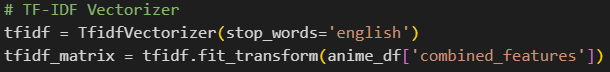

# 🎯 Laporan Proyek Machine Learning - Ferdian Sakti

## 📌 Project Overview

Dalam beberapa tahun terakhir, industri hiburan digital, khususnya **anime**, mengalami pertumbuhan yang pesat di seluruh dunia. Anime tidak hanya dinikmati oleh penggemar dari Jepang, tetapi juga oleh jutaan penonton di Asia, Amerika, Eropa, dan wilayah lainnya. Dengan begitu banyaknya jumlah judul anime yang tersedia, pengguna sering kali kesulitan dalam memilih anime yang sesuai dengan preferensi mereka.

Untuk menjawab tantangan tersebut, **sistem rekomendasi** menjadi solusi penting dalam membantu pengguna menemukan konten yang relevan dan menarik. Sistem ini memanfaatkan data tentang anime dan perilaku atau preferensi pengguna untuk memberikan saran yang personal dan akurat.

Proyek ini bertujuan untuk membangun sistem **rekomendasi anime berbasis konten** (*content-based filtering*) menggunakan dataset **Top 10.000 anime populer**. Pendekatan yang digunakan adalah **TF-IDF Vectorizer** dan **Cosine Similarity** untuk mengekstraksi fitur dan menghitung kemiripan antar-anime.

Dengan adanya sistem ini, pengguna akan lebih mudah menemukan anime baru yang mirip dengan anime favorit mereka, sehingga meningkatkan **pengalaman menonton** serta **kepuasan pengguna**.

---

## 💡 Business Understanding

### ❓ Problem Statements
Sistem rekomendasi anime yang efektif dan relevan sangat dibutuhkan untuk membantu pengguna menemukan tontonan baru yang sesuai dengan preferensi mereka. Namun, tantangannya adalah bagaimana membangun sistem yang mampu memahami kesamaan antar anime berdasarkan kontennya tanpa bergantung pada rating pengguna atau popularitas semata.

Model yang tidak mempertimbangkan relevansi konten dapat memberikan rekomendasi yang kurang tepat sasaran, sehingga menurunkan pengalaman pengguna. Selain itu, perlu adanya evaluasi yang terukur untuk menilai seberapa baik sistem mampu memberikan hasil yang relevan secara konsisten.

### 🎯 Goals
1.  Mengembangkan sistem rekomendasi berbasis konten (Content-Based Filtering) yang mampu menyarankan anime baru berdasarkan kesamaan konten dengan anime yang disukai pengguna.
2. Mengimplementasikan teknik TF-IDF Vectorizer dan Cosine Similarity untuk mengukur dan mengidentifikasi kemiripan antar anime.
3. Menyediakan mekanisme pencarian yang toleran terhadap kesalahan input (misspelling) dengan menggunakan pendekatan fuzzy matching.
4. Menampilkan Top-N anime yang paling mirip secara konten berdasarkan hasil perhitungan kemiripan.

---

## 📊 Data Understanding

Dataset yang digunakan dalam proyek ini diambil dari sumber Kaggle yang berjudul [Top 10,000 Anime (Popularity Index of 2024)](https://www.kaggle.com/datasets/praneshchowdhury/top-10000-anime-dataset-2024/data). Dataset ini berisi data terkait **10.000 judul anime populer**, dengan setiap baris merepresentasikan satu judul anime. 

### 🔢 Ringkasan Umum:
- **Jumlah Total Baris (Entitas):** 10.000  
- **Jumlah Total Kolom (Fitur/Variabel):** 6

### 🧱 Struktur Kolom Dataset

| Kolom       | Deskripsi                                                            | Tipe Data |
|-------------|----------------------------------------------------------------------|-----------|
| `Name`      | Judul Anime                                                          | object    |
| `Rating`    | Rating rata-rata dari pengguna (skala 1–10)                          | float64   |
| `Ranked`    | Peringkat global berdasarkan popularitas atau kualitas              | int64     |
| `Popularity`| Tingkat popularitas anime (biasanya dalam bentuk angka atau skor)    | object    |
| `Members`   | Jumlah anggota komunitas atau penonton yang menyukai anime tersebut | object    |
| `Type`      | Jenis anime (misal: TV, Movie, OVA, ONA, Special, dll.)             | object    |

### 🧹 Cek Nilai Null

Setelah memuat dataset ke dalam DataFrame, dilakukan pemeriksaan terhadap nilai null (missing value) untuk memastikan bahwa tidak ada data yang hilang pada kolom-kolom penting. Hasilnya menunjukkan bahwa **tidak ada nilai null** dalam dataset ini:

### 📈 Statistik Deskriptif

Untuk mendapatkan gambaran awal tentang distribusi data, dilakukan analisis statistik deskriptif menggunakan metode `.describe()` pada kolom numerik (`Rating`, `Ranked`, `Popularity`, dan `Members`). Berikut adalah hasilnya:

**Insight**:
- Rata-rata rating anime adalah **6.94** dengan standar deviasi **0.63**, menunjukkan distribusi yang relatif konsisten.
- **75% anime** memiliki rating minimal **6.42**.
- Rating tertinggi tercatat sebesar **9.32**.
- Distribusi peringkat tersebar merata dari 1 hingga 10.000, dengan rata-rata **5000.5**.
- **Tidak terdapat korelasi langsung** antara peringkat dan rating anime, mengindikasikan bahwa peringkat juga dipengaruhi oleh **popularitas**, bukan hanya rating.

## 📊 Distribusi Rating Anime

Distribusi rating anime pada grafik menunjukkan pola yang condong ke kanan (*right-skewed*), dengan sebagian besar anime memiliki rating antara **6.0 hingga 7.5**. Puncak distribusi berada pada kisaran **6.5 hingga 6.9**, dengan frekuensi anime lebih dari **600 judul**.

Setelah titik tersebut, jumlah anime dengan rating lebih tinggi mulai menurun secara bertahap, dengan sangat sedikit yang memperoleh rating di atas **8.5**. Distribusi ini mengindikasikan mayoritas anime memiliki rating cukup baik namun tidak luar biasa tinggi. Hanya segelintir yang mencapai skor mendekati sempurna, memperkuat temuan sebelumnya bahwa **rata-rata rating berada di sekitar 6.9**.

## 🏆 Top 10 Anime Berdasarkan Rating

Berdasarkan daftar Top 10 anime dengan rating tertinggi:

- **Sousou no Frieren** berada di peringkat pertama dengan rating **9.32**
- Diikuti oleh **Fullmetal Alchemist: Brotherhood** (9.10) dan **One Piece Fan Letter** (9.09)
- Mayoritas merupakan seri **TV**, kecuali **Gintama: The Final** (film)

Anime-anime ini menonjol karena alur cerita kuat dan kualitas produksi tinggi, contohnya:
- *Steins;Gate*
- *Hunter x Hunter (2011)*
- *Shingeki no Kyojin Season 3 Part 2*

Semua anime dalam daftar ini memiliki rating di atas **9.0** — mencerminkan apresiasi tinggi dari komunitas penggemar.

## 📈 Distribusi Tipe Anime

Berdasarkan distribusi tipe anime, dapat disimpulkan bahwa anime bertipe TV mendominasi dengan proporsi sebesar 46.7%, menunjukkan bahwa format serial televisi masih menjadi bentuk paling populer dan umum dalam industri anime. Selain itu, konten alternatif seperti OVA (12.5%) dan ONA (12.7%) menyumbang total 25.2%, yang mencerminkan tren meningkatnya konsumsi konten digital dan eksklusif yang tidak selalu tayang di televisi. Film anime (Movie) juga memiliki porsi yang cukup besar, yaitu 17.5%, menandakan bahwa rilisan layar lebar tetap memiliki tempat penting di kalangan penggemar. Tipe Special menyumbang 10.6%, biasanya berupa episode tambahan atau versi pendek dari anime, sementara kategori Unknown tidak ditemukan sama sekali dalam data (0.0%), menandakan bahwa seluruh entri memiliki tipe yang berhasil diidentifikasi.

## 📦 Analisis Boxplot Rating per Tipe Anime

Berdasarkan boxplot "Distribusi Rating per Tipe Anime", dapat disimpulkan bahwa anime bertipe Movie memiliki median rating tertinggi, menunjukkan bahwa secara umum film anime cenderung mendapatkan penilaian yang lebih baik dari penonton. Tipe TV berada di peringkat berikutnya, sementara Special, ONA, dan OVA memiliki median rating yang lebih rendah. Dari segi variasi rating, semua tipe anime kecuali Unknown menunjukkan interquartile range (IQR) yang cukup besar, yang berarti persebaran nilai rating di tiap kategori cukup luas. Menariknya, hampir semua kategori—termasuk TV, OVA, ONA, dan Special—menunjukkan adanya outlier di sisi atas, yang mencerminkan keberadaan beberapa anime dengan rating yang sangat tinggi. Tipe TV bahkan memiliki jumlah outlier paling banyak, yang mengindikasikan bahwa terdapat sejumlah anime TV yang sangat populer dan unggul dari yang lain. Secara umum, rentang rating untuk semua tipe (kecuali Unknown) berkisar antara 6.0 hingga lebih dari 9.0, menunjukkan adanya keragaman kualitas di setiap kategori anime.

## 🔁 Hubungan Rating vs Jumlah Members (Skala Logaritmik)

Berdasarkan visualisasi "Hubungan Rating vs Jumlah Members (Skala Logaritmik)", dapat disimpulkan bahwa terdapat korelasi positif antara rating dan jumlah members, yang menunjukkan bahwa anime dengan rating tinggi cenderung memiliki lebih banyak penggemar atau penonton. Dengan menggunakan skala logaritmik pada sumbu jumlah members, terlihat bahwa distribusi jumlah anggota sangat luas, mencakup dari ribuan hingga jutaan, yang tidak dapat diamati secara jelas jika menggunakan skala linear. Anime bertipe TV mendominasi di seluruh spektrum rating dan jumlah members, terlihat dari banyaknya anime TV yang memiliki jutaan members dan rating tinggi, serta ditandai dengan ukuran lingkaran besar dan warna ungu yang menonjol di area kanan atas grafik. Selain itu, mayoritas anime terkonsentrasi pada rentang rating antara 6.5 hingga 8.5, dengan jumlah members berkisar dari puluhan ribu hingga jutaan, mencerminkan populasi utama dalam distribusi data.

---

## 🛠️ Data Preparation
Bagian ini menjelaskan langkah-langkah yang dilakukan untuk mempersiapkan data sebelum digunakan dalam sistem rekomendasi.

### ✅ 1. Pengecekan Data Duplikat

Dilakukan pengecekan apakah ada baris duplikat dalam dataset.

Hasil: Tidak ditemukan data yang terduplikasi.

### 🔢 2. Konversi Kolom Numerik

Beberapa kolom seperti 'Popularity' dan 'Members' awalnya berbentuk teks, sehingga perlu dikonversi ke tipe numerik agar bisa digunakan dalam analisis statistik.

errors='coerce' digunakan untuk menghindari error jika nilai tidak bisa dikonversi.
Nilai yang gagal dikonversi akan menjadi NaN.

### 🧩 3. Pembuatan Fitur Gabungan

Untuk mendukung sistem rekomendasi berbasis konten, dibuat fitur gabungan dari 'Name' dan 'Type'.

Contoh hasil:

- "Dragon Ball TV", "Naruto Shippuden TV".

Fitur ini akan digunakan sebagai input untuk ekstraksi vektor TF-IDF.

### 🔍 4. Ekstraksi Fitur dengan TF-IDF Vectorizer

Digunakan TfidfVectorizer untuk mengubah teks menjadi vektor numerik yang dapat diproses oleh model cosine similarity.

Penjelasan:

- stop_words='english': kata-kata umum seperti "the", "and", dll. diabaikan.
- Hasil akhir berupa matriks TF-IDF yang siap digunakan untuk proses modeling.

---

## 🧠 Modeling (Content-Based Filtering)
Sistem rekomendasi ini menggunakan pendekatan Content-Based Filtering, yaitu metode yang merekomendasikan item berdasarkan kemiripan konten antar-item. Setelah data siap digunakan (dengan representasi vektor dari fitur teks), proses pemodelan dilakukan melalui langkah-langkah berikut:

### 🔷 Langkah-Langkah Pembangunan Model :

#### 1. Perhitungan Cosine Similarity

Setelah ekstraksi fitur dengan TF-IDF, dilakukan perhitungan cosine similarity untuk mengukur tingkat kemiripan antara setiap pasangan anime.

Hasil : Matriks cosine similarity yang menunjukkan seberapa mirip setiap anime satu sama lain.

#### 2. Mapping Nama Anime ke Indeks

Untuk mempermudah pencarian, dibuat mapping dari nama anime ke indeks baris dalam DataFrame.

Tujuan : Mencari anime berdasarkan judul dengan cepat. 

#### 3. Fungsi Pencarian Judul Terdekat

Karena pengguna mungkin salah mengetik judul, digunakan fungsi get_close_matches untuk menemukan judul anime yang paling mendekati dari input pengguna.

Parameter : 
- n=1: Hanya mengambil satu judul terbaik.
- cutoff=0.6: Batas kesamaan minimal agar dianggap cocok (skala 0–1).

#### 4. Fungsi Rekomendasi Berbasis Konten (Content-Based)

Model sistem rekomendasi ini bergantung pada kesamaan konten saja tanpa memperhitungkan rating atau faktor lainnya.

Penjelasan Cara Kerja:
1. Cari anime terdekat berdasarkan input pengguna.
2. Ambil 30 anime termirip berdasarkan cosine similarity.
3. Hitung dan urutkan berdasarkan skor kemiripan.
4. Tampilkan Top-10 anime terbaik berdasarkan konten.

#### 5. Contoh Penggunaan Sistem Rekomendasi

Berikut snippet code contoh penggunaan sistem rekomendasi dan menampilkannya dalam bentuk tabel dengan menampilkan jumlah 10 rekomendasi anime teratas yang akan direkomendasikan ke user :

Sebagai contoh, kita coba sistem ini dengan judul "Dragon Ball".

---

## 🎯 Evaluation

### 🎯 Tujuan Evaluasi

Bagian ini bertujuan untuk mengevaluasi kualitas sistem rekomendasi anime berbasis konten menggunakan metrik evaluasi yang relevan, sehingga kita dapat mengukur seberapa baik model memberikan rekomendasi yang benar-benar relevan dan bermakna bagi pengguna.

### 🔹 a. Precision

Precision adalah salah satu metrik umum dalam sistem rekomendasi yang mengukur seberapa banyak rekomendasi yang diberikan oleh sistem benar-benar relevan.

### 🧮 b. Formula Precision

**Kriteria relevansi rekomendasi:**
- ✅ Tipe sama dengan anime input (misal: TV, Movie, dll.)
- ✅ Rating ≥ 5 (threshold minimal untuk anime berkualitas layak tonton)

### ❓ c. Mengapa Menggunakan Precision?

- Sistem rekomendasi ini bersifat **content-based**, jadi penting untuk memastikan bahwa anime yang direkomendasikan memiliki **kesamaan konten (tipe)** dengan anime input.
- Threshold **rating ≥ 5** digunakan untuk memastikan hanya anime **berkualitas** yang direkomendasikan.
- **Precision** cocok digunakan karena fokus pada **relevansi** dari rekomendasi yang dihasilkan, bukan jumlah total anime yang tersedia (berbeda dengan recall).

### ✅ d. Hasil Evaluasi Sistem Rekomendasi

Contoh penggunaan keyword: **"Dragon Ball"**

Sistem menghasilkan **10 rekomendasi anime termirip** berdasarkan kemiripan konten dan rating.

### 📌 e. Kriteria Relevansi

- Tipe anime harus sama dengan *"Dragon Ball"* → **TV**
- Rating anime ≥ **5**

### 🧾 f. Hitung Precision

Dari hasil rekomendasi ketika user menyukai anime *Dragon Ball* dengan tipe **TV**, maka hasil rekomendasi yang didapatkan adalah merekomendasikan tipe anime yang sama.

Perhitungan precision:

Sehingga, hasil **precision** yang didapatkan adalah **70%**.

### 📊 g. Penjelasan Hasil Evaluasi

- Precision sebesar **70%** berarti:
  - ✅ 7 dari 10 rekomendasi anime memiliki:
    1. Tipe yang sama dengan *"Dragon Ball"* (TV)
    2. Rating ≥ 5 → **layak ditonton**
  - ❌ 3 dari 10 rekomendasi **tidak** memenuhi kedua kriteria tersebut.
